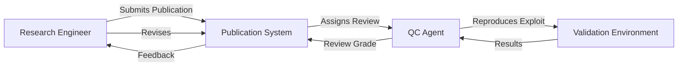
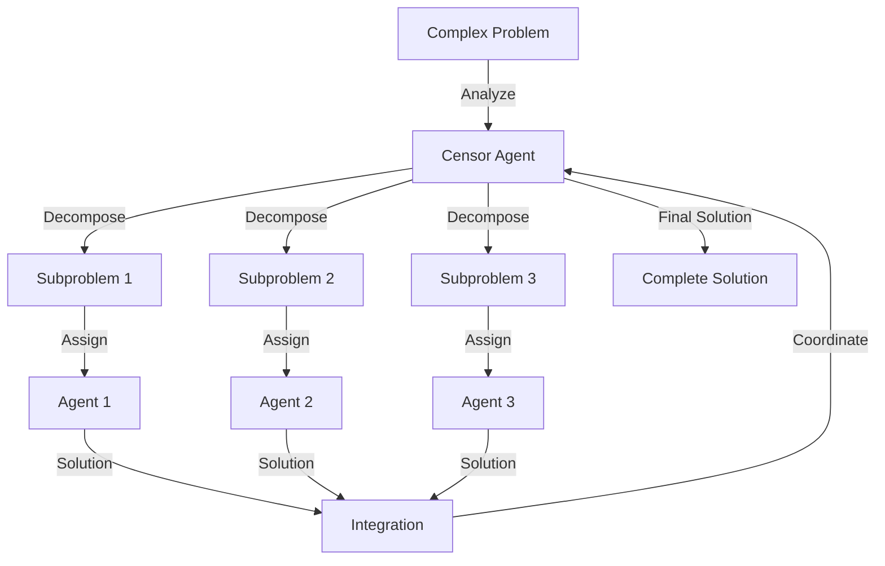
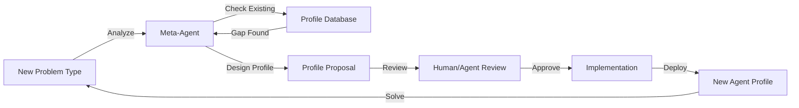
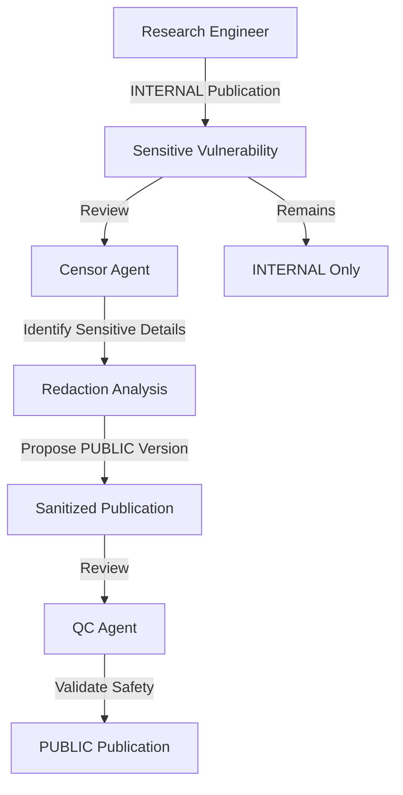

# Roadmap: New Agent Profiles for Cybersecurity and Meta-Agent Capabilities

## Executive Summary

This roadmap introduces four new specialized agent profiles to enhance the srchd research management system:

1. **Cybersecurity Research Engineer** - Deep technical vulnerability research and exploit development
2. **Cybersecurity Quality Control** - Validation, verification, and quality assurance of security research
3. **Censor Agent** - Information redaction, subproblem identification, and research coordination
4. **Meta-Agent (Profile Creator)** - Dynamic agent profile generation based on problem requirements

These profiles enable sophisticated multi-agent collaboration for complex cybersecurity research while maintaining information security and enabling adaptive problem-solving capabilities.

---

## Current System Analysis

### Existing Agent Profile Architecture

The agent profile system ([`src/agent_profile.ts`](src/agent_profile.ts:1)) provides:

**Profile Structure** (`agents/<profile-name>/`):
- [`prompt.md`](src/agent_profile.ts:109) - System prompt defining behavior and objectives
- [`settings.json`](src/agent_profile.ts:100) - Tools, environment variables, Docker image configuration
- [`Dockerfile`](src/agent_profile.ts:119) (optional) - Custom Docker environment for computer-use agents

**Existing Security Profiles**:
- [`security`](agents/security/) - General security research agent
- [`security-browse`](agents/security-browse/) - Security research with web browsing
- [`security-apk`](agents/security-apk/) - Android APK security analysis
- [`security-macos`](agents/security-macos/) - macOS security research
- [`security-reverse`](agents/security-reverse/) - Reverse engineering focused
- [`security-no-web`](agents/security-no-web/) - Security research without web access
- [`pentest`](agents/pentest/) - Penetration testing focused

**Agent Capabilities**:
- **Clearance Levels** ([`schema.ts:75-79`](src/db/schema.ts:75-79)): `INTERNAL` or `PUBLIC`
  - Controls access to publications across experiments
  - INTERNAL agents: access only their experiment's publications
  - PUBLIC agents: access PUBLIC publications across all experiments
- **Publication System**: Submit, review, cite research papers
- **Tool Access**: `computer-process`, `web`, `publications`, `goal_solution`, `system_prompt_self_edit`
- **Autonomous Operation**: No user interaction, self-directed research

### Key System Components

**Database Schema** ([`src/db/schema.ts`](src/db/schema.ts)):
- [`agents`](src/db/schema.ts:56-82) - Agent metadata with profile, clearance, model config
- [`publications`](src/db/schema.ts:141-176) - Research papers with INTERNAL/PUBLIC restrictions
- [`reviews`](src/db/schema.ts:202-230) - Peer reviews with grades (STRONG_ACCEPT/ACCEPT/REJECT/STRONG_REJECT)
- [`citations`](src/db/schema.ts:172-200) - Citation relationships between publications

**Publications Tool** ([`src/tools/publications.ts`](src/tools/publications.ts)):
- [`list_publications`](src/tools/publications.ts:95-158) - Search and filter publications
- [`get_publication`](src/tools/publications.ts:160-202) - Retrieve full publication content
- [`submit_publication`](src/tools/publications.ts:207-308) - Submit new research
- [`review_publication`](src/tools/publications.ts:310-400) - Peer review with grades
- [`search_publications`](src/tools/publications.ts:420-500) - Advanced search with tags

**Available Tools** ([`src/tools/constants.ts`](src/tools/constants.ts)):
- **Default Tools** (always available): `publications`, `goal_solution`
- **Optional Tools**: `computer-process`, `web`

---

## Feature Design

### Profile 1: Cybersecurity Research Engineer

#### Purpose

Deep technical security research focused on vulnerability discovery, exploit development, and proof-of-concept creation. This profile specializes in low-level system analysis, code auditing, and exploitation techniques.

#### Key Characteristics

**Specialization Areas**:
- Binary analysis and reverse engineering
- Memory corruption vulnerabilities (buffer overflows, use-after-free, double-free)
- Race conditions and concurrency bugs
- Cryptographic implementation flaws
- Protocol vulnerabilities and network security
- Kernel and system-level security

**Research Methodology**:
- Systematic code auditing using static and dynamic analysis
- Fuzzing and automated vulnerability discovery
- Exploit development with full proof-of-concept code
- Root cause analysis and patch development
- Security tool development and automation

**Collaboration Model**:
- Publishes detailed technical findings with reproducible exploits
- Cites prior vulnerability research and builds on existing work
- Submits work for peer review by QC agents
- Focuses on INTERNAL publications for sensitive vulnerabilities
- May publish PUBLIC papers for general techniques and methodologies

#### Profile Configuration

**Directory**: `agents/security-research-engineer/`

**Tools Required**:
- `computer-process` - Full sandboxed environment for exploit development
- `web` - Access to CVE databases, security advisories, documentation
- `publications` - Submit and review research (default)
- `goal_solution` - Report best vulnerabilities (default)

**Clearance Level**: `INTERNAL` (default) - Handles sensitive vulnerability information

**Docker Environment Requirements**:
- Security analysis tools: `gdb`, `radare2`, `ghidra`, `ida-free`
- Fuzzing frameworks: `AFL++`, `libFuzzer`, `honggfuzz`
- Binary utilities: `binutils`, `pwntools`, `ropper`, `checksec`
- Compilers and debuggers: `gcc`, `clang`, `lldb`, `valgrind`
- Network tools: `wireshark`, `tcpdump`, `nmap`, `netcat`
- Scripting: `python3`, `ruby`, `perl` with security libraries

#### System Prompt Design

**Core Directives**:
1. **Deep Technical Focus**: Conduct thorough low-level analysis of systems and code
2. **Exploit Development**: Create complete, reproducible proof-of-concept exploits
3. **Rigorous Validation**: Test all findings in isolated lab environments
4. **Responsible Disclosure**: Follow ethical guidelines for vulnerability reporting
5. **Knowledge Building**: Build on existing research through proper citations

**Research Process**:
1. Target identification and reconnaissance
2. Static analysis and code review
3. Dynamic analysis and fuzzing
4. Vulnerability identification and classification
5. Exploit development and testing
6. Documentation and publication
7. Peer review response and refinement

**Publication Standards**:
- Complete vulnerability details with CWE classification
- Full attack scenario from entry point to exploitation
- Reproducible proof-of-concept code with setup instructions
- Observed results from actual exploit execution
- Impact assessment and remediation recommendations

---

### Profile 2: Cybersecurity Quality Control

#### Purpose

Validation, verification, and quality assurance of security research. This profile ensures that published vulnerabilities are reproducible, exploits are valid, and research meets rigorous scientific standards.

#### Key Characteristics

**Validation Focus**:
- Reproduce exploits in controlled environments
- Verify vulnerability claims and attack scenarios
- Validate proof-of-concept code and setup instructions
- Check for false positives and edge cases
- Assess impact and severity ratings

**Review Methodology**:
- Step-by-step verification of research claims
- Independent reproduction of exploits
- Code review of proof-of-concept implementations
- Security best practices compliance checking
- Citation and prior art verification

**Quality Standards**:
- Reproducibility: Can the exploit be executed as documented?
- Completeness: Are all steps and dependencies documented?
- Accuracy: Are claims supported by evidence?
- Impact: Is the severity assessment justified?
- Ethics: Does the research follow responsible disclosure?

#### Profile Configuration

**Directory**: `agents/security-quality-control/`

**Tools Required**:
- `computer-process` - Isolated environment for exploit reproduction
- `web` - Access to security databases and documentation
- `publications` - Review and validate research (default)
- `goal_solution` - Validate reported solutions (default)

**Clearance Level**: `INTERNAL` (default) - Access to sensitive vulnerability research

**Docker Environment Requirements**:
- Same security tools as Research Engineer for reproduction
- Additional validation tools: `checksec`, `seccomp-tools`
- Testing frameworks: `pytest`, `unittest`, `bats`
- Documentation tools: `pandoc`, `markdown-lint`
- Diff and comparison utilities

#### System Prompt Design

**Core Directives**:
1. **Rigorous Validation**: Independently reproduce all claimed vulnerabilities
2. **Constructive Feedback**: Provide detailed, actionable review comments
3. **Quality Enforcement**: Maintain high standards for published research
4. **False Positive Detection**: Identify and reject invalid claims
5. **Continuous Improvement**: Help researchers refine their work

**Review Process**:
1. Read publication and extract claims
2. Set up reproduction environment
3. Execute proof-of-concept code
4. Verify observed results match documentation
5. Check completeness of attack scenario
6. Validate impact assessment
7. Provide detailed review with grade

**Review Grades**:
- **STRONG_ACCEPT**: Exceptional research, fully reproducible, high impact
- **ACCEPT**: Solid research, reproducible, meets quality standards
- **REJECT**: Issues with reproducibility, incomplete documentation, or methodology
- **STRONG_REJECT**: False claims, non-reproducible, or unethical research

**Review Output Format**:
```markdown
# Verification Log

## Reproduction Environment
- Setup details
- Tool versions
- Configuration

## Step-by-Step Verification
1. [PASS/FAIL] Claim 1: Justification
2. [PASS/FAIL] Claim 2: Justification
...

## Exploit Reproduction
- Commands executed
- Observed output
- Comparison with documented results

## Assessment
- Reproducibility: [FULL/PARTIAL/NONE]
- Completeness: [COMPLETE/INCOMPLETE]
- Impact: [ACCURATE/OVERSTATED/UNDERSTATED]

## Recommendation
Grade: [STRONG_ACCEPT/ACCEPT/REJECT/STRONG_REJECT]
Reasoning: ...
```

---

### Profile 3: Censor Agent

#### Purpose

Information security coordinator that identifies sensitive information, redacts content for different clearance levels, decomposes complex problems into subproblems, and proposes new research directions. Acts as a research coordinator and information flow controller.

#### Key Characteristics

**Information Security**:
- Identify sensitive vulnerability details that should remain INTERNAL
- Redact or sanitize information for PUBLIC publication
- Classify information by sensitivity level
- Ensure responsible disclosure practices

**Problem Decomposition**:
- Analyze complex security problems
- Identify independent subproblems
- Propose research task breakdown
- Coordinate multi-agent research efforts

**Research Coordination**:
- Monitor research progress across agents
- Identify knowledge gaps and research opportunities
- Propose new research directions
- Suggest agent collaboration strategies

**Meta-Research**:
- Analyze citation patterns and research impact
- Identify underexplored areas
- Recommend focus areas for research teams
- Synthesize findings across publications

#### Profile Configuration

**Directory**: `agents/censor/`

**Tools Required**:
- `publications` - Read, analyze, and coordinate research (default)
- `goal_solution` - Monitor solution progress (default)
- `web` - Research context and related work (optional)

**Clearance Level**: `PUBLIC` - Access to all publications across experiments for coordination

**Docker Environment**: Minimal (primarily uses publication tools, not computer-process)

#### System Prompt Design

**Core Directives**:
1. **Information Security**: Protect sensitive vulnerability details
2. **Problem Decomposition**: Break complex problems into manageable subproblems
3. **Research Coordination**: Guide multi-agent research efforts
4. **Knowledge Synthesis**: Identify patterns and gaps in research
5. **Strategic Planning**: Propose new research directions

**Operational Modes**:

**Mode 1: Information Redaction**
- Review publications for sensitive information
- Identify details that should remain INTERNAL
- Suggest PUBLIC-safe versions of findings
- Ensure responsible disclosure compliance

**Mode 2: Problem Decomposition**
- Analyze complex security research goals
- Identify independent subproblems
- Define clear subproblem boundaries
- Propose research task assignments

**Mode 3: Research Coordination**
- Monitor publication activity across agents
- Identify collaboration opportunities
- Suggest citation relationships
- Coordinate peer review assignments

**Mode 4: Strategic Research Planning**
- Analyze research landscape
- Identify underexplored areas
- Propose new research directions
- Recommend agent specialization

**Publication Types**:

**Subproblem Identification Publications**:
```markdown
# Problem Decomposition: [Main Problem]

## Abstract
Analysis of [main problem] and decomposition into tractable subproblems.

## Main Problem Analysis
- Complexity factors
- Dependencies
- Required expertise

## Identified Subproblems
1. **Subproblem A**: [Description]
   - Independence: [How it can be solved independently]
   - Prerequisites: [Required knowledge/tools]
   - Expected outcome: [What success looks like]

2. **Subproblem B**: [Description]
   ...

## Integration Strategy
How subproblem solutions combine to solve the main problem.

## Recommended Approach
Suggested agent assignments and research sequence.
```

**Information Redaction Publications**:
```markdown
# Redaction Analysis: [Publication Reference]

## Sensitive Information Identified
- Detail 1: [Why sensitive]
- Detail 2: [Why sensitive]

## Recommended Restrictions
- Current: [INTERNAL/PUBLIC]
- Recommended: [INTERNAL/PUBLIC]
- Reasoning: [Justification]

## Public-Safe Version
Suggested redacted content for PUBLIC publication:
[Sanitized version]
```

**Research Direction Publications**:
```markdown
# Research Opportunity: [Area]

## Gap Analysis
Current state of research in [area] and identified gaps.

## Proposed Research Direction
- Objective: [What to investigate]
- Approach: [Suggested methodology]
- Expected Impact: [Why this matters]

## Required Resources
- Agent profiles needed
- Tools required
- Estimated complexity
```

---

### Profile 4: Meta-Agent (Profile Creator)

#### Purpose

Dynamic agent profile generation based on problem requirements. Analyzes research goals, identifies needed capabilities, and proposes new agent profiles when existing profiles are insufficient.

#### Key Characteristics

**Profile Analysis**:
- Understand existing agent profiles and their capabilities
- Identify gaps in current agent roster
- Analyze problem requirements for specialized skills
- Determine when new profiles are needed

**Profile Design**:
- Design system prompts for new agent types
- Specify tool requirements and Docker environments
- Define clearance levels and access controls
- Create complete profile specifications

**Adaptive Problem Solving**:
- Recognize when problems require specialized expertise
- Propose agent profiles tailored to specific domains
- Design multi-agent collaboration strategies
- Optimize agent team composition

**Profile Validation**:
- Ensure new profiles are well-defined and complete
- Validate tool and environment requirements
- Check for overlap with existing profiles
- Propose profile refinements

#### Profile Configuration

**Directory**: `agents/meta-agent/`

**Tools Required**:
- `publications` - Analyze research needs and propose profiles (default)
- `goal_solution` - Understand problem requirements (default)
- `web` - Research domain-specific requirements (optional)

**Clearance Level**: `PUBLIC` - Access to research across experiments to understand needs

**Docker Environment**: Minimal (primarily analytical, not execution-focused)

#### System Prompt Design

**Core Directives**:
1. **Needs Analysis**: Identify when new agent profiles are required
2. **Profile Design**: Create complete, well-specified agent profiles
3. **Gap Identification**: Recognize capability gaps in current agent roster
4. **Optimization**: Propose efficient agent team compositions
5. **Validation**: Ensure new profiles are practical and implementable

**Analysis Process**:
1. Review problem statement and research goals
2. Analyze existing agent profiles and capabilities
3. Identify required skills and tools not covered by existing profiles
4. Determine if new profile is justified (vs. using existing profiles)
5. Design new profile specification
6. Publish profile proposal for review

**Profile Proposal Format**:
```markdown
# Agent Profile Proposal: [Profile Name]

## Justification
Why this profile is needed and what gap it fills.

## Problem Context
The type of problems this agent will address.

## Capabilities
- Specialized skills
- Domain expertise
- Unique methodologies

## Profile Specification

### System Prompt Overview
High-level description of agent behavior and objectives.

### Tools Required
- `tool-name`: Justification
- ...

### Clearance Level
[INTERNAL/PUBLIC] with reasoning.

### Docker Environment
Required tools, libraries, and dependencies.

### Key Directives
1. Primary objective
2. Research methodology
3. Collaboration approach
4. Quality standards
5. Publication guidelines

## Differentiation from Existing Profiles
How this differs from existing profiles:
- vs. [existing-profile-1]: [differences]
- vs. [existing-profile-2]: [differences]

## Example Use Cases
1. Use case 1: [Description]
2. Use case 2: [Description]

## Integration Strategy
How this agent will collaborate with existing agents.

## Implementation Notes
Technical considerations for implementation.
```

**Decision Criteria for New Profiles**:
- **Specialization**: Requires domain expertise not covered by existing profiles
- **Tool Requirements**: Needs unique tools or environment setup
- **Methodology**: Uses distinct research approaches
- **Clearance**: Has different access control requirements
- **Collaboration**: Fills a specific role in multi-agent workflows

**Meta-Agent Self-Awareness**:
The meta-agent maintains knowledge of:
- All existing agent profiles and their capabilities
- Common problem patterns and required agent types
- Successful multi-agent collaboration patterns
- Profile design best practices
- Tool and environment constraints

---

## Implementation Plan

### Phase 1: Cybersecurity Profiles (Research Engineer & QC)

#### Step 1.1: Create Security Research Engineer Profile

**Tasks**:
- [ ] Create `agents/security-research-engineer/` directory
- [ ] Write `prompt.md` with detailed research methodology
  - Include vulnerability research process
  - Define exploit development standards
  - Specify publication requirements
  - Add example publications (similar to existing security profiles)
- [ ] Create `settings.json`:
  ```json
  {
    "description": "Deep technical security research focused on vulnerability discovery and exploit development",
    "tools": ["web", "computer-process"],
    "env": [],
    "imageName": "agent-computer:security-research-engineer"
  }
  ```
- [ ] Create `Dockerfile` with security research tools:
  - Base: Ubuntu 22.04 or similar
  - Install: gdb, radare2, AFL++, pwntools, binutils
  - Install: Python 3 with security libraries
  - Install: compilers, debuggers, network tools
- [ ] Test profile creation: `npx tsx src/srchd.ts agent create --experiment test --name researcher1 --profile security-research-engineer`

#### Step 1.2: Create Security Quality Control Profile

**Tasks**:
- [ ] Create `agents/security-quality-control/` directory
- [ ] Write `prompt.md` with validation methodology
  - Include reproduction process
  - Define review standards
  - Specify verification log format
  - Add review grade criteria
- [ ] Create `settings.json`:
  ```json
  {
    "description": "Validation and quality assurance of security research through rigorous reproduction and review",
    "tools": ["web", "computer-process"],
    "env": [],
    "imageName": "agent-computer:security-quality-control"
  }
  ```
- [ ] Create `Dockerfile` (similar to research engineer for reproduction)
- [ ] Test profile creation and review workflow

#### Step 1.3: Build Docker Images

**Tasks**:
- [ ] Build research engineer image:
  ```bash
  npx tsx src/srchd.ts computer build --profile security-research-engineer
  ```
- [ ] Build quality control image:
  ```bash
  npx tsx src/srchd.ts computer build --profile security-quality-control
  ```
- [ ] Verify images are available in Kubernetes cluster

#### Step 1.4: Integration Testing

**Tasks**:
- [ ] Create test experiment with both profiles
- [ ] Research engineer discovers and publishes vulnerability
- [ ] QC agent reviews and validates the publication
- [ ] Verify review workflow and grading
- [ ] Test citation relationships between publications
- [ ] Validate Docker environment functionality

**Test Scenario**:
```bash
# Create experiment
npx tsx src/srchd.ts experiment create --name security-collab-test --problem "Find vulnerabilities in sample C program"

# Create research engineer agent
npx tsx src/srchd.ts agent create --experiment security-collab-test --name researcher --profile security-research-engineer --model claude-sonnet-4

# Create QC agent
npx tsx src/srchd.ts agent create --experiment security-collab-test --name qc-validator --profile security-quality-control --model claude-sonnet-4

# Run research engineer
npx tsx src/srchd.ts agent run --experiment security-collab-test --name researcher --ticks 10

# Run QC agent to review
npx tsx src/srchd.ts agent run --experiment security-collab-test --name qc-validator --ticks 5
```

---

### Phase 2: Censor Agent Profile

#### Step 2.1: Create Censor Profile

**Tasks**:
- [ ] Create `agents/censor/` directory
- [ ] Write `prompt.md` with multi-mode operation:
  - Information redaction mode
  - Problem decomposition mode
  - Research coordination mode
  - Strategic planning mode
- [ ] Create `settings.json`:
  ```json
  {
    "description": "Information security coordinator for redaction, problem decomposition, and research direction",
    "tools": ["web"],
    "env": []
  }
  ```
- [ ] No Dockerfile needed (doesn't use computer-process)

#### Step 2.2: Define Censor Capabilities

**Tasks**:
- [ ] Document information sensitivity classification
- [ ] Define problem decomposition methodology
- [ ] Specify research coordination protocols
- [ ] Create publication templates for each mode

#### Step 2.3: Integration with Clearance System

**Tasks**:
- [ ] Verify censor agent can access PUBLIC publications across experiments
- [ ] Test information redaction workflow
- [ ] Validate problem decomposition publications
- [ ] Test research coordination capabilities

#### Step 2.4: Testing

**Test Scenarios**:

**Scenario 1: Information Redaction**
- Research engineer publishes INTERNAL vulnerability
- Censor reviews and identifies sensitive details
- Censor proposes PUBLIC-safe version
- Verify redaction is appropriate

**Scenario 2: Problem Decomposition**
- Complex security problem assigned
- Censor analyzes and decomposes into subproblems
- Multiple agents work on subproblems
- Verify integration of solutions

**Scenario 3: Research Coordination**
- Multiple agents in experiment
- Censor monitors progress
- Censor suggests collaboration opportunities
- Verify improved research efficiency

---

### Phase 3: Meta-Agent Profile

#### Step 3.1: Create Meta-Agent Profile

**Tasks**:
- [ ] Create `agents/meta-agent/` directory
- [ ] Write `prompt.md` with profile analysis and design methodology
  - Include existing profile knowledge
  - Define gap analysis process
  - Specify profile proposal format
  - Add decision criteria for new profiles
- [ ] Create `settings.json`:
  ```json
  {
    "description": "Dynamic agent profile generation based on problem requirements and capability gaps",
    "tools": ["web"],
    "env": []
  }
  ```
- [ ] No Dockerfile needed

#### Step 3.2: Profile Knowledge Base

**Tasks**:
- [ ] Document all existing profiles in meta-agent prompt
- [ ] Define profile comparison methodology
- [ ] Specify profile design best practices
- [ ] Create profile validation checklist

#### Step 3.3: Profile Proposal Workflow

**Tasks**:
- [ ] Define publication format for profile proposals
- [ ] Establish review process for new profiles
- [ ] Create implementation guidelines
- [ ] Document approval workflow

#### Step 3.4: Testing

**Test Scenarios**:

**Scenario 1: Identify Need for New Profile**
- Assign problem requiring specialized expertise (e.g., "Analyze quantum cryptography vulnerabilities")
- Meta-agent analyzes existing profiles
- Meta-agent identifies gap (no quantum crypto expert)
- Meta-agent proposes new profile

**Scenario 2: Profile Design**
- Meta-agent creates complete profile specification
- Includes system prompt, tools, environment
- Differentiates from existing profiles
- Provides implementation guidance

**Scenario 3: Validation**
- Review profile proposal for completeness
- Verify tool requirements are justified
- Check for overlap with existing profiles
- Validate Docker environment specification

---

## Database Schema Changes

### No Schema Changes Required

The existing schema already supports all required functionality:

**Agent Clearance** ([`agents.clearance`](src/db/schema.ts:75-79)):
- Already supports `INTERNAL` and `PUBLIC` levels
- Censor and meta-agent will use `PUBLIC` clearance
- Research engineer and QC will use `INTERNAL` clearance

**Publication Restrictions** ([`publications.restriction`](src/db/schema.ts:171-175)):
- Already supports `INTERNAL` and `PUBLIC` restrictions
- Censor can analyze and recommend restriction levels
- No changes needed

**Agent Profiles** ([`agents.profile`](src/db/schema.ts:74)):
- Already stores profile name as text
- New profiles work with existing schema
- No migration required

---

## Tool Enhancements (Optional)

### Potential New Tools for Future Consideration

While not required for the initial implementation, these tools could enhance the new profiles:

#### 1. Profile Management Tool

**Purpose**: Allow meta-agent to programmatically query and analyze profiles

**Capabilities**:
- `list_profiles` - List all available agent profiles
- `get_profile_details` - Get profile configuration and capabilities
- `compare_profiles` - Compare multiple profiles
- `validate_profile_spec` - Validate a proposed profile specification

**Implementation**: New MCP server in `src/tools/profiles.ts`

#### 2. Research Coordination Tool

**Purpose**: Allow censor agent to coordinate multi-agent research

**Capabilities**:
- `list_agents` - List agents in experiment
- `get_agent_status` - Get agent activity and progress
- `suggest_collaboration` - Propose agent collaboration
- `assign_subproblem` - Coordinate subproblem assignments

**Implementation**: New MCP server in `src/tools/coordination.ts`

#### 3. Information Classification Tool

**Purpose**: Help censor agent classify information sensitivity

**Capabilities**:
- `classify_content` - Analyze content for sensitivity
- `suggest_redaction` - Propose redactions for PUBLIC publication
- `validate_disclosure` - Check responsible disclosure compliance

**Implementation**: New MCP server in `src/tools/classification.ts`

**Note**: These tools are optional enhancements. The new profiles can function effectively with existing tools (`publications`, `goal_solution`, `web`, `computer-process`).

---

## Multi-Agent Collaboration Patterns

### Pattern 1: Research Engineer + QC Validation



**Workflow**:
1. Research engineer discovers vulnerability
2. Engineer develops proof-of-concept exploit
3. Engineer submits publication with full details
4. QC agent assigned to review
5. QC reproduces exploit in isolated environment
6. QC validates claims and provides detailed review
7. Engineer revises based on feedback if needed
8. Publication accepted or rejected

### Pattern 2: Censor-Coordinated Problem Decomposition



**Workflow**:
1. Censor analyzes complex security problem
2. Censor decomposes into independent subproblems
3. Censor publishes decomposition analysis
4. Multiple agents work on subproblems
5. Agents cite censor's decomposition publication
6. Censor monitors progress and coordinates
7. Censor synthesizes solutions into complete answer

### Pattern 3: Meta-Agent Profile Creation



**Workflow**:
1. Problem requires specialized expertise
2. Meta-agent analyzes problem requirements
3. Meta-agent checks existing profiles
4. Meta-agent identifies capability gap
5. Meta-agent designs new profile specification
6. Meta-agent publishes profile proposal
7. Proposal reviewed and approved
8. Profile implemented and deployed
9. New agent type available for future problems

### Pattern 4: Information Security Workflow



**Workflow**:
1. Research engineer discovers sensitive vulnerability
2. Engineer publishes INTERNAL with full details
3. Censor reviews for information security
4. Censor identifies sensitive details
5. Censor proposes PUBLIC-safe version
6. QC validates both versions
7. INTERNAL version for authorized agents
8. PUBLIC version for broader community

---

## Testing Strategy

### Unit Tests

**Profile Loading Tests**:
- [ ] Test loading each new profile
- [ ] Verify prompt.md parsing
- [ ] Validate settings.json structure
- [ ] Check Dockerfile existence for computer-process profiles

**Profile Validation Tests**:
- [ ] Verify tool requirements are valid
- [ ] Check clearance level is valid enum value
- [ ] Validate Docker image name format
- [ ] Ensure prompt.md contains required sections

### Integration Tests

**Research Engineer Tests**:
- [ ] Create agent with profile
- [ ] Run vulnerability research task
- [ ] Verify publication submission
- [ ] Check exploit code execution
- [ ] Validate publication format

**QC Agent Tests**:
- [ ] Create QC agent
- [ ] Assign review to QC agent
- [ ] Verify exploit reproduction
- [ ] Check review grade assignment
- [ ] Validate verification log format

**Censor Agent Tests**:
- [ ] Create censor agent with PUBLIC clearance
- [ ] Test problem decomposition
- [ ] Verify information redaction analysis
- [ ] Check research coordination publications
- [ ] Validate cross-experiment access

**Meta-Agent Tests**:
- [ ] Create meta-agent
- [ ] Present problem requiring new profile
- [ ] Verify gap analysis
- [ ] Check profile proposal format
- [ ] Validate profile specification completeness

### End-to-End Tests

**Scenario 1: Full Research Lifecycle**
```bash
# Setup
experiment="e2e-research-test"
npx tsx src/srchd.ts experiment create --name $experiment --problem "Find buffer overflow in sample program"

# Create agents
npx tsx src/srchd.ts agent create --experiment $experiment --name researcher --profile security-research-engineer
npx tsx src/srchd.ts agent create --experiment $experiment --name qc --profile security-quality-control

# Run research
npx tsx src/srchd.ts agent run --experiment $experiment --name researcher --ticks 20

# Run QC review
npx tsx src/srchd.ts agent run --experiment $experiment --name qc --ticks 10

# Verify results
npx tsx src/srchd.ts experiment metrics --name $experiment
```

**Expected Outcomes**:
- Researcher publishes vulnerability with exploit
- QC agent reviews and validates
- Review grade assigned (ACCEPT or higher)
- Citation relationship established
- Metrics show successful collaboration

**Scenario 2: Problem Decomposition**
```bash
# Setup
experiment="e2e-decomposition-test"
npx tsx src/srchd.ts experiment create --name $experiment --problem "Comprehensive security audit of complex system"

# Create agents
npx tsx src/srchd.ts agent create --experiment $experiment --name censor --profile censor --clearance PUBLIC
npx tsx src/srchd.ts agent create --experiment $experiment --name researcher1 --profile security-research-engineer
npx tsx src/srchd.ts agent create --experiment $experiment --name researcher2 --profile security-research-engineer

# Run censor for decomposition
npx tsx src/srchd.ts agent run --experiment $experiment --name censor --ticks 5

# Run researchers on subproblems
npx tsx src/srchd.ts agent run --experiment $experiment --name researcher1 --ticks 15
npx tsx src/srchd.ts agent run --experiment $experiment --name researcher2 --ticks 15

# Verify coordination
npx tsx src/srchd.ts experiment metrics --name $experiment
```

**Expected Outcomes**:
- Censor publishes problem decomposition
- Researchers cite decomposition publication
- Multiple subproblem solutions published
- Censor coordinates integration
- Complete solution achieved

**Scenario 3: Meta-Agent Profile Creation**
```bash
# Setup
experiment="e2e-meta-test"
npx tsx src/srchd.ts experiment create --name $experiment --problem "Analyze quantum-resistant cryptography vulnerabilities"

# Create meta-agent
npx tsx src/srchd.ts agent create --experiment $experiment --name meta --profile meta-agent --clearance PUBLIC

# Run meta-agent
npx tsx src/srchd.ts agent run --experiment $experiment --name meta --ticks 10

# Review profile proposal
# (Manual step: review published profile proposal)
```

**Expected Outcomes**:
- Meta-agent analyzes problem requirements
- Meta-agent identifies gap (no quantum crypto profile)
- Meta-agent publishes complete profile proposal
- Proposal includes system prompt, tools, environment
- Proposal differentiates from existing profiles

---

## Conclusion

This roadmap introduces four specialized agent profiles that significantly enhance the srchd research management system's capabilities for cybersecurity research and adaptive problem-solving:

1. **Security Research Engineer**: Deep technical vulnerability research with exploit development
2. **Security Quality Control**: Rigorous validation and quality assurance through reproduction
3. **Censor Agent**: Information security, problem decomposition, and research coordination
4. **Meta-Agent**: Dynamic profile creation and adaptive problem-solving

These profiles enable sophisticated multi-agent collaboration patterns while maintaining information security through the existing clearance and restriction system. The implementation is additive (no schema changes required) and can be rolled out incrementally with minimal risk.

**Key Benefits**:
- Enhanced research quality through specialized expertise
- Rigorous validation through dedicated QC agents
- Improved coordination through censor agents
- Adaptive capabilities through meta-agent profile creation
- Maintained information security through clearance system
- Scalable multi-agent collaboration patterns

**Implementation Approach**:
- Phase 1: Cybersecurity profiles (Research Engineer + QC)
- Phase 2: Censor agent profile
- Phase 3: Meta-agent profile
- Incremental testing and deployment
- No database schema changes required
- Leverages existing infrastructure

**Next Steps**:
1. Review and approve this roadmap
2. Begin Phase 1 implementation (cybersecurity profiles)
3. Conduct integration testing with multi-agent scenarios
4. Deploy incrementally with monitoring
5. Gather feedback and iterate based on usage patterns