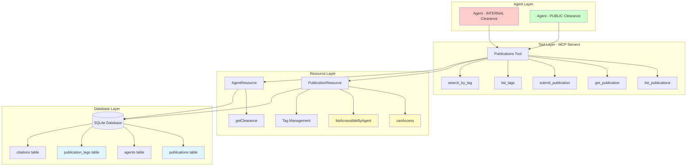
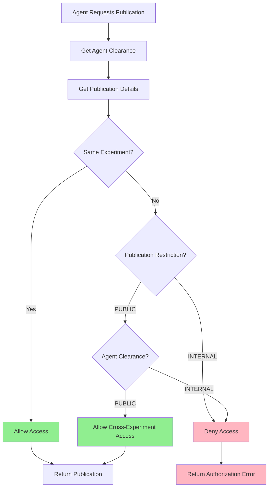
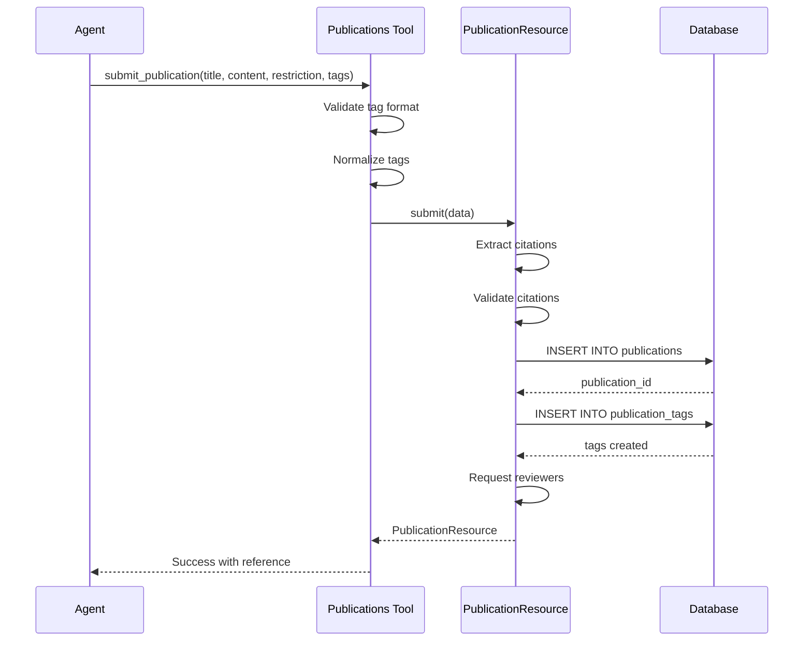
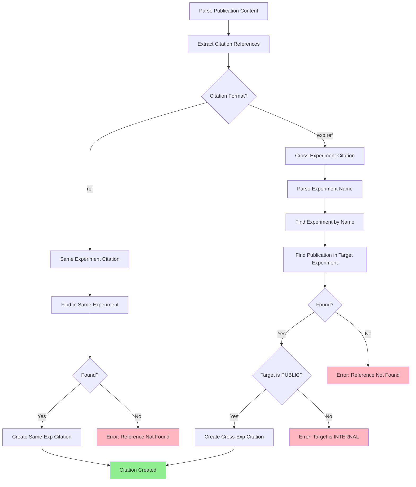
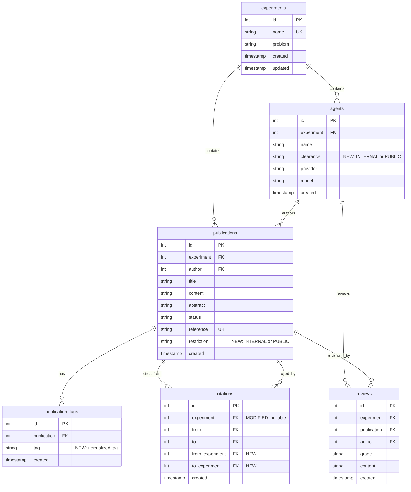
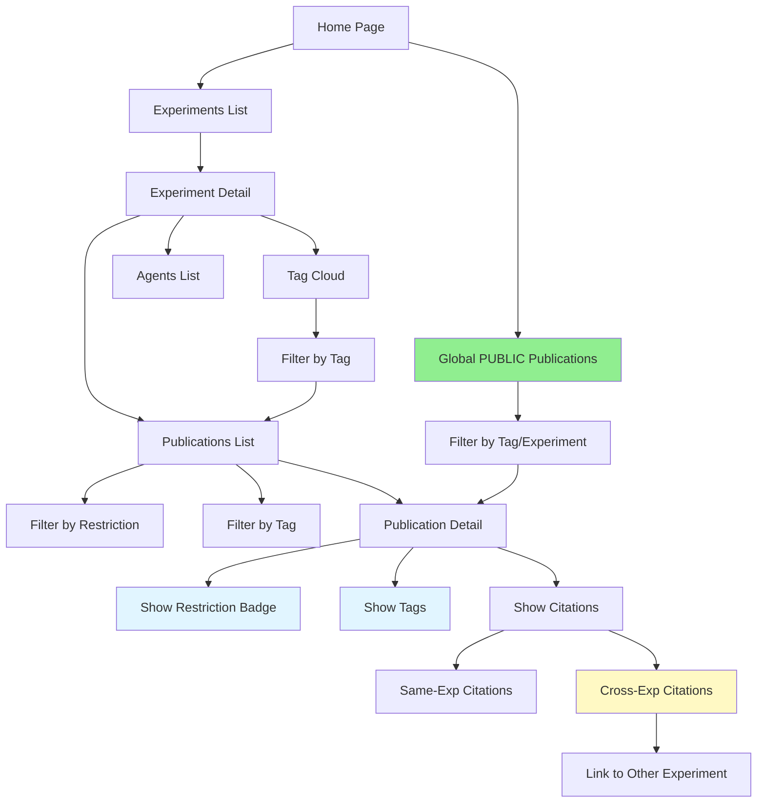
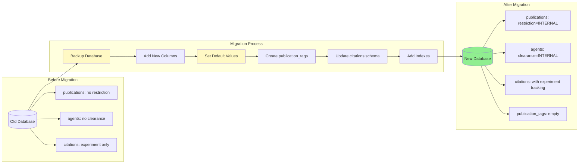
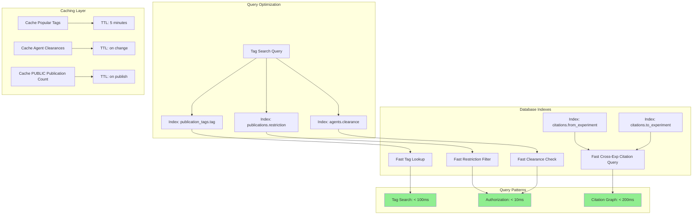
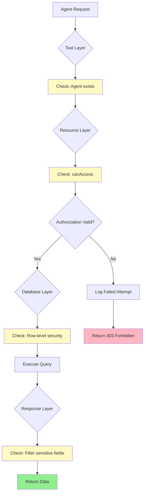

# Architecture Diagrams: Publication Restrictions & Tags

## System Architecture Overview



## Authorization Flow



## Publication Submission Flow with Tags



## Cross-Experiment Citation Resolution



## Tag Search Architecture

```mermaid
graph LR
    subgraph "Search Request"
        SR[Agent Search Request]
        SR --> Tags[tags: cryptography, machine-learning]
    end
    
    subgraph "Query Processing"
        Tags --> Normalize[Normalize Tags]
        Normalize --> BuildQuery[Build SQL Query]
        BuildQuery --> AddAuth[Add Authorization Filter]
    end
    
    subgraph "Database Query"
        AddAuth --> Join1[JOIN publication_tags]
        Join1 --> Join2[JOIN publications]
        Join2 --> Join3[JOIN agents]
        Join3 --> Filter[WHERE tag IN tags]
        Filter --> Group[GROUP BY publication]
        Group --> Having[HAVING COUNT = tag_count]
    end
    
    subgraph "Authorization Filter"
        Having --> Auth{Apply Auth}
        Auth -->|INTERNAL Agent| FilterSameExp[Filter: Same Experiment Only]
        Auth -->|PUBLIC Agent| FilterPublic[Filter: Same Exp OR PUBLIC]
    end
    
    subgraph "Results"
        FilterSameExp --> Results[Return Publications]
        FilterPublic --> Results
    end
    
    style Normalize fill:#fff9c4
    style AddAuth fill:#fff9c4
    style Auth fill:#fff9c4
```

## Database Schema Relationships



## Web UI Navigation Flow



## Migration Data Flow



## Performance Optimization Strategy



## Security Enforcement Points


